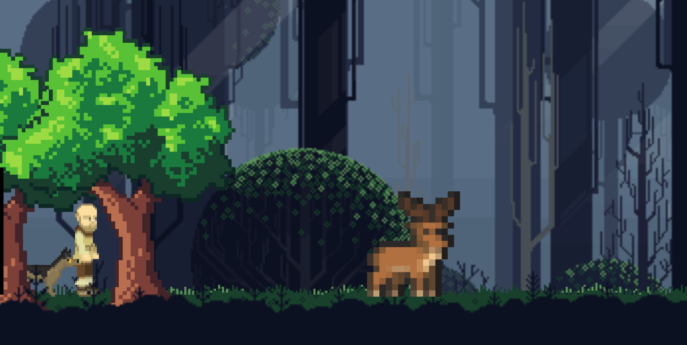
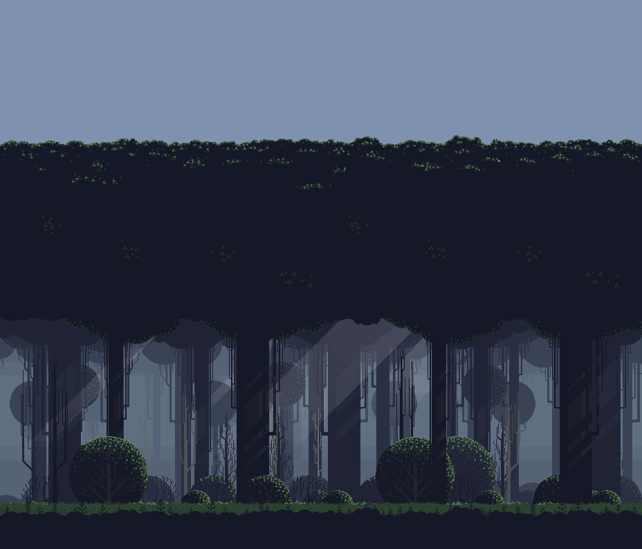

# 🌲 O Cervo das Sombras

> Projeto desenvolvido durante a Game Jam **Into The Woods**, hospedada na plataforma Itch.io.

Este repositório contém o desenvolvimento do jogo **O Cervo das Sombras**, criado como parte da participação na Game Jam **Into The Woods**.

A competição possui duração de **7 dias**, período durante o qual os participantes devem idealizar, desenvolver e publicar um protótipo jogável baseado nos temas propostos pela organização do evento.

O objetivo principal da atividade é exercitar habilidades de prototipagem rápida, desenvolvimento de jogos, design de mecânicas, narrativa interativa e trabalho em equipe sob restrições de tempo.

---

## Sobre a Game Jam

### Tema Principal

> **Going on a hunt with a companion**

Os participantes devem criar uma experiência em que o jogador realize uma caçada acompanhado por um companheiro, seja ele humano ou animal.

O companheiro deve ter relevância na experiência, reagindo ao ambiente, participando de diálogos e contribuindo para a narrativa do jogo.

### Tema Secreto Obrigatório

> **Natural Predator**

Além do tema principal, os projetos devem incorporar o conceito de um predador natural de alguma forma, seja através da narrativa, ambientação ou mecânicas.

### Requisitos da Jam

- Experiência curta (10 a 30 minutos)
- Ambientação em floresta
- Presença de um companheiro humano ou animal
- Foco em exploração e atmosfera
- Construção gradual de tensão
- Narrativa ambiental e interação entre os personagens

---

## Sobre o Jogo

Esse é um protótipo desenvolvido utilizando a engine **GDevelop 5**.

No jogo, o jogador assume o papel de Hosea, um caçador solitário que vive em uma cabana isolada na floresta acompanhado apenas de seu fiel cão. Após sucessivas aparições de um misterioso cervo, Hosea decide persegui-lo até uma floresta sombria que os moradores da região evitam há gerações.

Durante a jornada, o jogador explora ambientes, encontra pistas e interage com elementos que revelam fragmentos do passado do protagonista. Conforme avança pela floresta, a linha entre realidade e imaginação se torna cada vez mais tênue, transformando a caçada em um confronto contra seus próprios medos, arrependimentos e pensamentos autodestrutivos.

O projeto busca transmitir sensações de horror psicológico, inquietação e autossabotagem, utilizando a figura do cervo como representação simbólica do verdadeiro predador da história: os conflitos internos do próprio protagonista.

---

## Tecnologias Utilizadas

- GDevelop 5
- Efeitos sonoros: [[CC BY 4.0](https://creativecommons.org/licenses/by/4.0/)]

---

## Equipe

### Julio Martins
 [GitHub](https://github.com/devjuliomartins)
 [Linkedin](https://www.linkedin.com/in/devjuliomartins/)

### Felipe Alves 
 [GitHub](https://github.com/FelipeS04)
 [Linkedin](https://www.linkedin.com/in/felipe-alves-soares-49b505366/)

---

## Imagens

### Gameplay

### Floresta

---

## Links

#### [Página da Jam](https://itch.io/jam/into-the-woods-jam)

#### [Página do Jogo no Itch.io](https://julio-martins.itch.io/o-cervo-das-sombras)

---

## Observação

Este projeto foi desenvolvido exclusivamente para fins acadêmicos e para participação na Game Jam **Into The Woods** no Itch.io.
